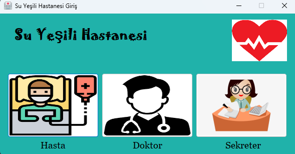
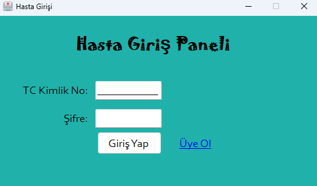
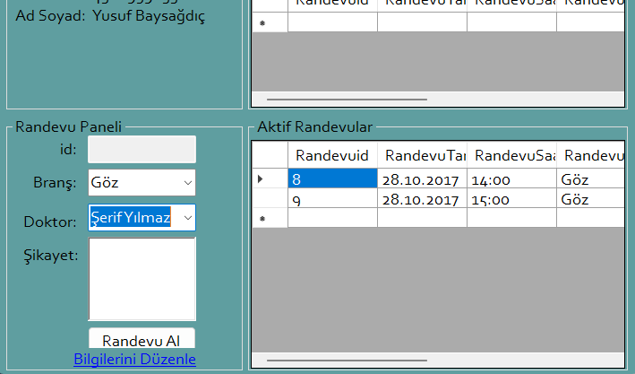
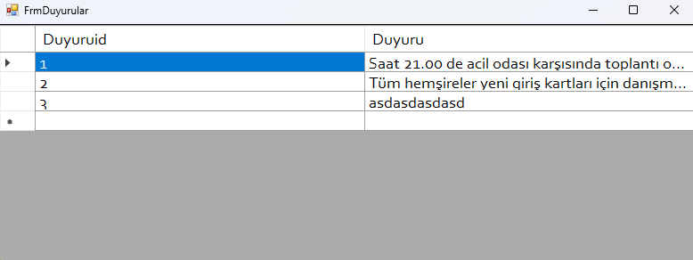
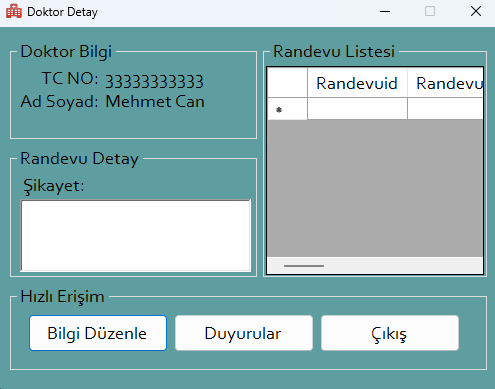
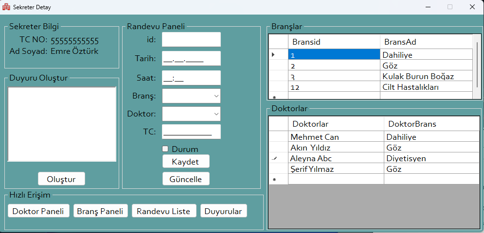

# 🏥 Proje_Hospital

**Proje_Hospital**, C# ile geliştirilen kapsamlı bir **Hastane Yönetim Sistemi** uygulamasıdır.  
Bu proje, hastane içi veri yönetimini (hasta, doktor, randevu vb.) artırmayı, süreçleri dijitalleştirmeyi ve günlük operasyonları kolaylaştırmayı amaçlar.

---

## 📌 Proje Hakkında

Bu proje bir **sağlık hizmetleri yönetim sistemi** olarak geliştirilmiştir ve C# dili ile yazılmıştır.  
Uygulama, bir hastanenin temel operasyonlarını yönetebilecek modüller içerir:

- Hasta kayıt ve takibi
- Doktor yönetimi
- Bölüm ve servis yönetimi
- Randevu planlama
- Muayene ve tedavi süreçleri
- Kullanıcı yetki ve roller
  
## 🧠 Ana Özellikler

### 👩‍⚕️ Hasta Yönetimi
- Hasta kaydı oluşturma
- Kişisel ve tıbbi bilgileri güncelleme
- Hasta arama ve listeleme
- Hasta geçmişi görüntüleme

### 🧑‍⚕️ Doktor Yönetimi
- Doktor profili ekleme / silme / güncelleme
- Branş bazlı doktor listesi
- Doktor program saatleri tanımlama

### ⏱️ Randevu Planlama
- Hasta → doktor randevu eşleştirme
- Randevu zamanlama
- Doktor uygunluk kontrolü
- Randevu onay / iptal işlemleri

### 🏥 Klinik ve Birim Yönetimi
- Bölüm / servis tanımlama
- Birim bazlı personel ve hasta yerleşimi
- Servis saatleri ve yoğunluk takipleri

### 💊 Tedavi ve Muayene Süreçleri
- Hasta muayene kayıtları

---

## 🎨 Kullanılan Teknolojiler

| Teknoloji | Rol |
|-----------|------|
| **C#** | Ana programlama dili |
| **.NET / .NET Framework** | Uygulama altyapısı |
| **Visual Studio / Visual Studio Code** | IDE |
| **SQL Server / MSSQL** | Veritabanı |
| **Entity Framework (EF)**|
| **MVC / Katmanlı Mimari**|

